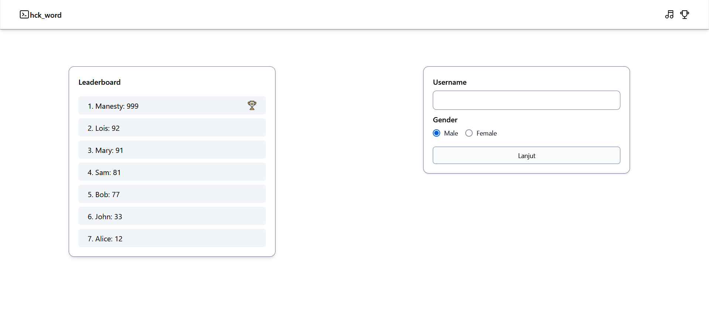
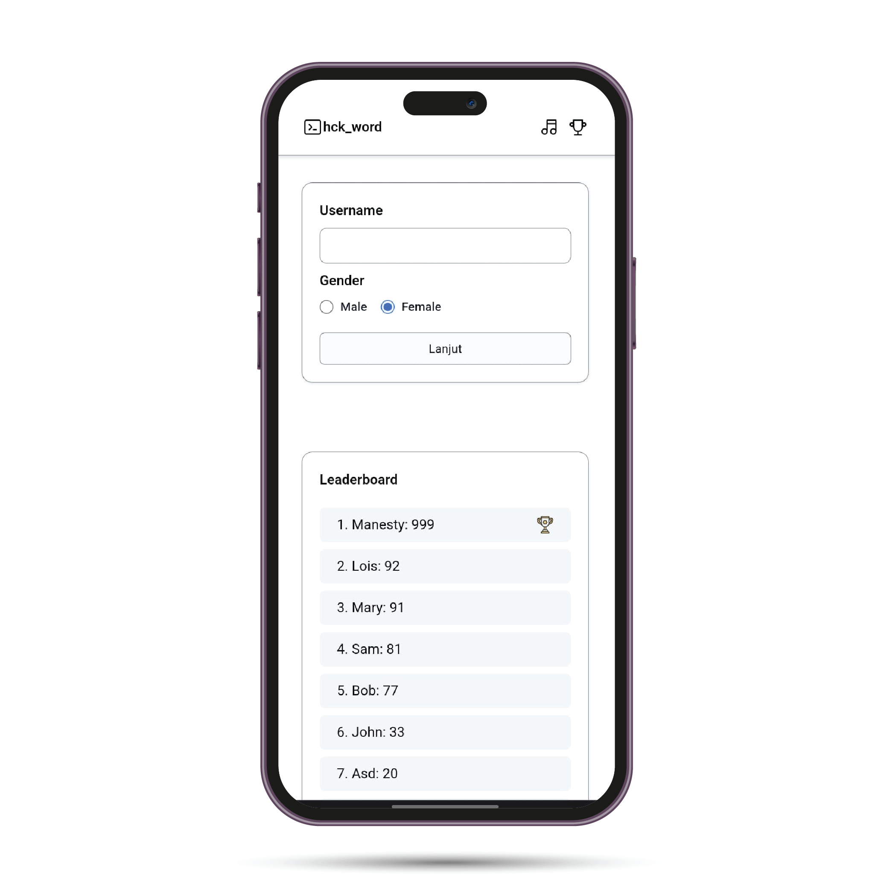

<h1 align="center"> Hackathon Phase 0 </h1>

<h1 align="center">
   
<svg xmlns="http://www.w3.org/2000/svg" class="icon icon-tabler icon-tabler-terminal-2" width="200" height="200"
            viewBox="0 0 24 24" stroke-width="1" stroke="currentColor" fill="none" stroke-linecap="round"
            stroke-linejoin="round">
            <path stroke="none" d="M0 0h24v24H0z" fill="none"></path>
            <path d="M8 9l3 3l-3 3"></path>
            <path d="M13 15l3 0"></path>
            <path d="M3 4m0 2a2 2 0 0 1 2 -2h14a2 2 0 0 1 2 2v12a2 2 0 0 1 -2 2h-14a2 2 0 0 1 -2 -2z"></path>
          </svg>
   
  hck_word
   
</h1>

<h4 align="center">hck_word is a type of word game where you have to determine the correct word among missing letters. The type of questions used are based on common knowledge vocabulary. This game is perfect for eliminating boredom and reducing stress caused by live coding.</h4>

  <a href="#features">Features</a> •
  <a href="#screenshot">Screenshot</a> •
  <a href="https://dziunincode69.github.io/scramble-word.github.io/" target="_blank">Demo</a> •
  <a href="#credits">Credits</a> •
  <a href="#credits">Team</a> 

## Features

- Username validation to play games
- Show / hide leaderboard
- Play / pause music
- Save your score to local storage and put to Leaderboard
- Simple UI and Responsive Design

## Screenshot

 

 

## Credits

This software uses the following open source packages:

- [VanillaJS](http://vanilla-js.com/)
- [Tailwind](https://tailwindcss.com/)
- [tabler-icon](https://tabler-icons.io/)

## Team

- [Alif Dzikir Nur](https://github.com/dziunincode69) - Fullstack  
- [Ami Miftahun Situmorang](https://github.com/AmiMiftahul) - Backend 
- [Rama Putra](https://github.com/ramaedwindap) - Frontend  
- [Heryo Rizaldi](https://github.com/jonoman31) - Frontend  
